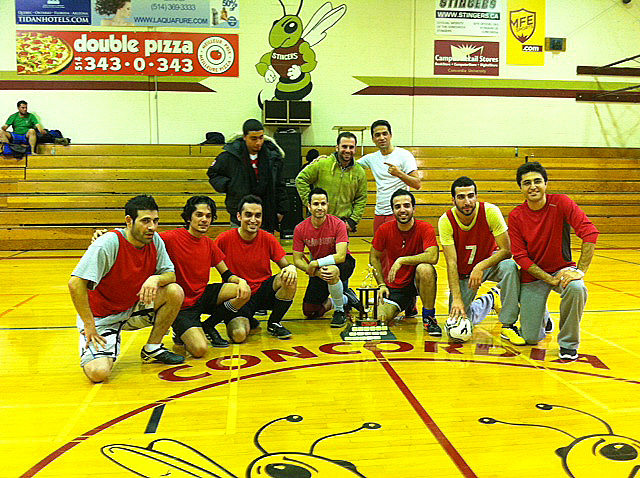
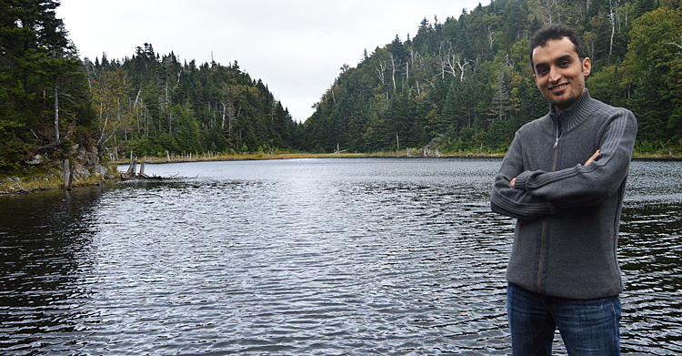

  

#### [Home](index.md) | [Awards](awards.md) | [Hobbies](hobbies.md)

-----------------------------

• **Painting:** Practical painting experience with water color, oil on canvas, sketching and pencil colors for more than 10 years – participated in a group exhibition in 2008 - [Sample Paintings](https://www.flickr.com/photos/143175424@N05/albums/72157672068948112).

• **Photography:** Practiced landscape and urban photography for more than 6 years - [Sample Images](https://www.flickr.com/photos/143175424@N05/).

• **Learning about other cultures and traditions.**

• **Playing and watching soccer:** *Champion* of Concordia indoor soccer competitive league – fall 2011, *runner-up* of Concordia indoor soccer competitive league – winter 2012.

  

• **Biking**

• **Nature:** Camping and Hiking. 

# **Spoken Languages:**

• **English** (Fluent)  
• **French** (Advanced)  
• **Farsi** (Native)
