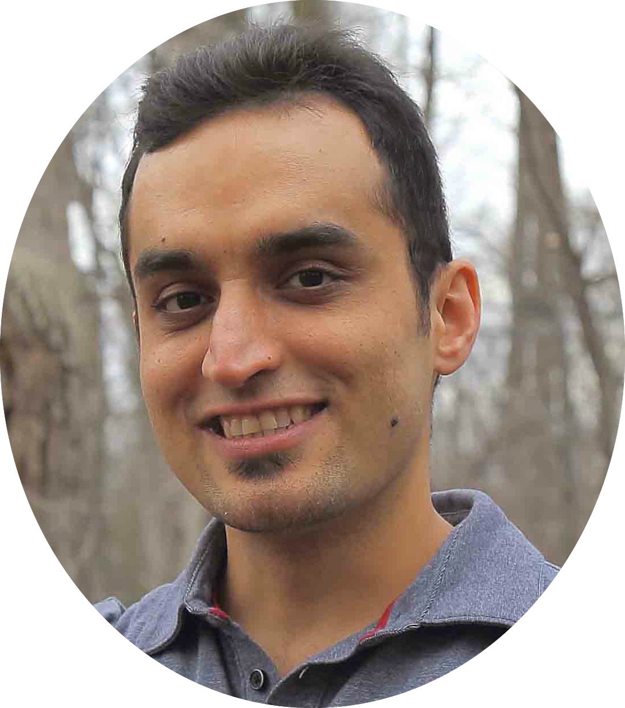

  

#### [Home](index.md) | [Research](research.md) | [Awards](awards.md) | [Hobbies](hobbies.md)

-----------------------------

I am a senior research scientist at the Samsung AI Center Toronto. Before joining Samsung, I was a postdoctoral researcher in the computer vision lab ([CVLab](https://www.epfl.ch/labs/cvlab/)) at [EPFL](https://www.epfl.ch/en/) in Lausanne-Switzerland, working with [Pascal Fua](https://people.epfl.ch/pascal.fua/bio?lang=en) and [Mathieu Salzmann](https://people.epfl.ch/mathieu.salzmann) for more than 3 years. 
I completed my PhD in 2019 at [Mila](https://mila.quebec/en/) and the [University of Montreal](http://www.umontreal.ca/en/) under the supervision of [Christopher Pal](https://scholar.google.ca/citations?user=1ScWJOoAAAAJ&hl=en) and [Pascal Vincent](https://scholar.google.com/citations?user=WBCKQMsAAAAJ). After my PhD, I held a 6-month postdoctoral position at Mila and [Polytéchnique Montréal](https://www.polymtl.ca/en) with Christopher Pal.    

My broad research domains are developing machine learning and deep learning techniques for computer vision and vision-language problems. In particular, I am interested in developing semi-supervised, self-supervised, unsupervised, and out-of-domain generalization learning techniques, by leveraging task-related, computer-vision, or auxiliary priors. More recently, I have been exploring the use of large language and vision-language models for image quality analysis and perception. The application of my projects has been in image restoration and enhancement, low-light image denoising, image super-resolution, image quality analysis, multi-view geometry, 2D landmark localization, 3D human pose estimation, medical image segmentation and domain adaptation, bias-mitigation analysis, image generation, visual question answering, animal action recognition, and road-obstacle and anomaly detection. 

During my studies, I interned at Morgan Stanley as a trade technology analyst and at NVIDIA's Learning & Perception Research team (led by [Jan Kautz](https://research.nvidia.com/person/jan-kautz)) as a deep learning researcher. My PhD was partially funded by Fonds de Recherche du Québec - Nature et Technologies ([FRQNT](http://www.frqnt.gouv.qc.ca/en/le-frqnt)).

 
 
 
 

 &nbsp;&nbsp;
 &nbsp;&nbsp;
 &nbsp;&nbsp;

