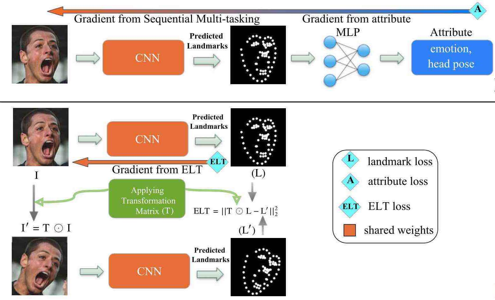
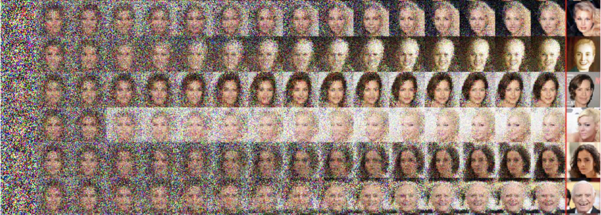
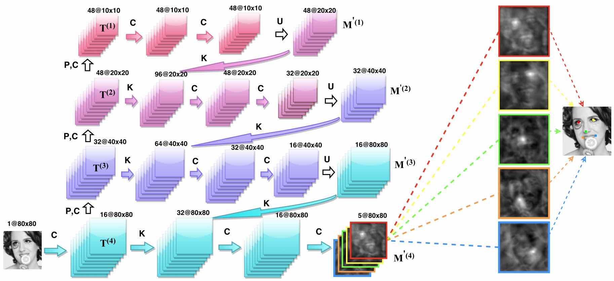
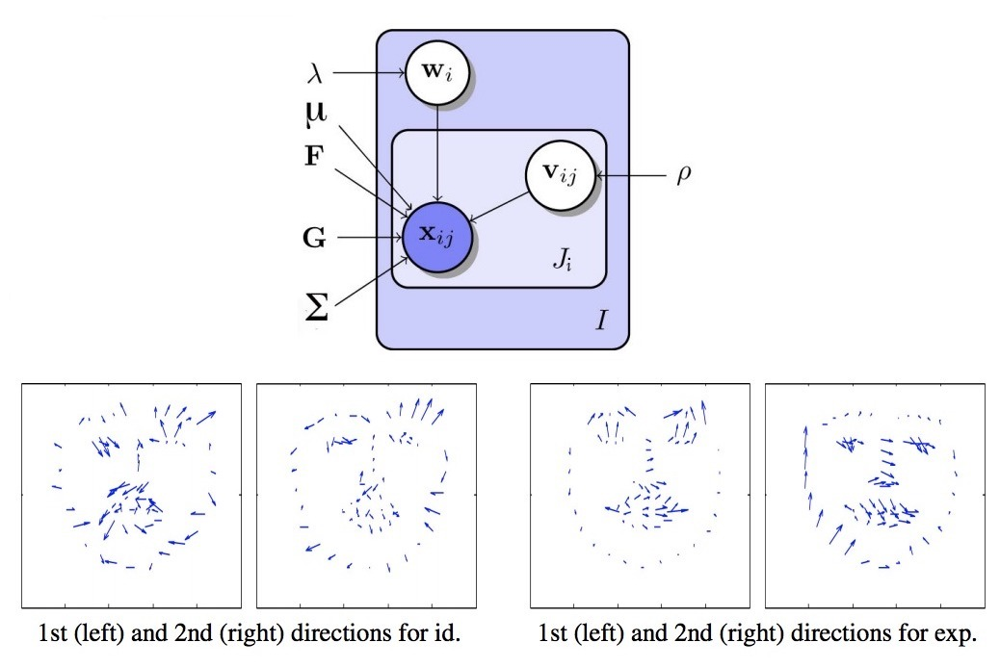

  

#### [Home](index.md) | [Research](research.md) | [Awards](awards.md) | [Hobbies](hobbies.md)

-----------------------------

[Google scholar](https://scholar.google.com/citations?user=8uou2n4AAAAJ&hl=en)
 
 

### Machine Learning and Deep Learning
 

**[Improving Landmark Localization with Semi-Supervised Learning](https://arxiv.org/abs/1709.01591)**  
Sina Honari, Pavlo Molchanov, Stephen Tyree, Pascal Vincent, Christopher Pal, Jan Kautz  
*Computer Vision and Pattern Recognition (CVPR)*, 2018.

 
 
 
 
 
 

**[Learning to generate samples from noise through infusion training](https://arxiv.org/abs/1703.06975)**  
Florian Bordes, Sina Honari, Pascal Vincent  
*International Conference on Learning Representations (ICLR)*, 2017.
 
 
 
 

**[Recombinator networks: Learning coarse-to-fine feature aggregation](https://arxiv.org/abs/1511.07356)**  
Sina Honari, Jason Yosinski, Pascal Vincent, Christopher Pal  
*Computer Vision and Pattern Recognition (CVPR)*, 2016, spotlight presentation (**9.7%**) [[code](https://github.com/SinaHonari/RCN)].

 
 
 
 

 

**[Improving facial analysis and performance driven animation through disentangling identity and expression](https://arxiv.org/abs/1512.08212)**  
David Rim*, Sina Honari*, Md Kamrul Hasan, Chris Pal 
*Image and Vision Computing Journal*, 2016.

 
 
 
 

-----------------------------

### Trust Estimation in Multi-Agent Systems

<h6> 
My master’s research was on representing trust in multi-agent systems. A multi-agent system is composed of many interacting, rational and autonomous computer systems known as agents, each with their own objectives and knowledge of each other. In general agents may cooperate with each other or pursue their own objectives greedily. Trust is the expectation or the belief that a party will act benignly and cooperatively with the trusting party. In this research I proposed a trust representation of an agent based on possibility theory which allowed merging of information received from different agents considering the uncertainties in the acquired information. This allowed representing the trust of an agent through the information acquired from other agents.
</h6>

 
 
 

**Uncertainty-Based Trust Estimation in a Multi-Valued Trust Environment** 
Sina Honari, Brigitte Jaumard, Jamal Bentahar  
*International Journal on Artificial Intelligence Tools (IJAIT)*, 2013.

**An Approach on Merging Agents' Trust Distributions in a Possibilitic Domain**  
Sina Honari, Brigitte Jaumard, Jamal Bentahar 
*Communications in Computer and Information Science (CCIS)*, 2012.

**Merging Successive Possibility Distributions for Trust Estimation Under Uncertainty in Multi-Agent Systems** 
Sina Honari, Brigitte Jaumard, Jamal Bentahar 
*4th International Conference on Agents and Artificial Intelligence (ICAART)*, 2012.

**Under Uncertainty Trust Estimation through Unknown Agents, in a Multi-Valued Trust Environment** 
Sina Honari, Brigitte Jaumard, Jamal Bentahar 
*23rd International Conference on Tools with Artificial Intelligence (ICTAI)*, 2011.
