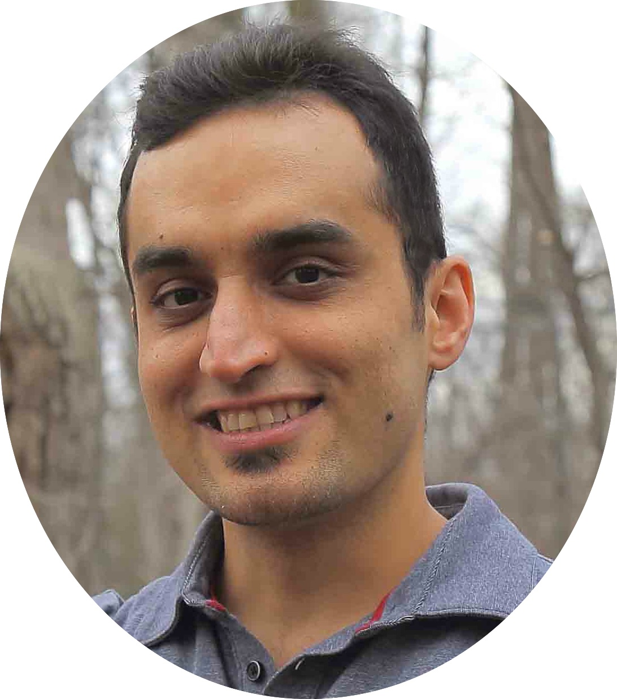
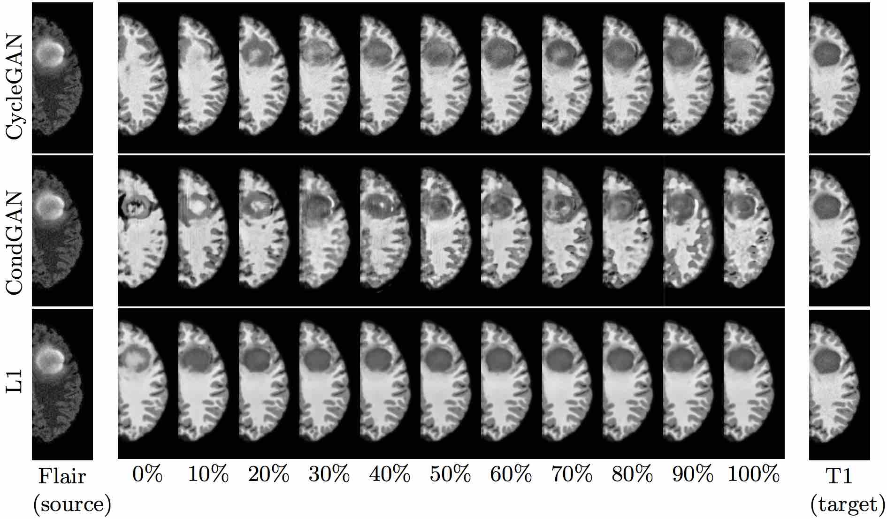
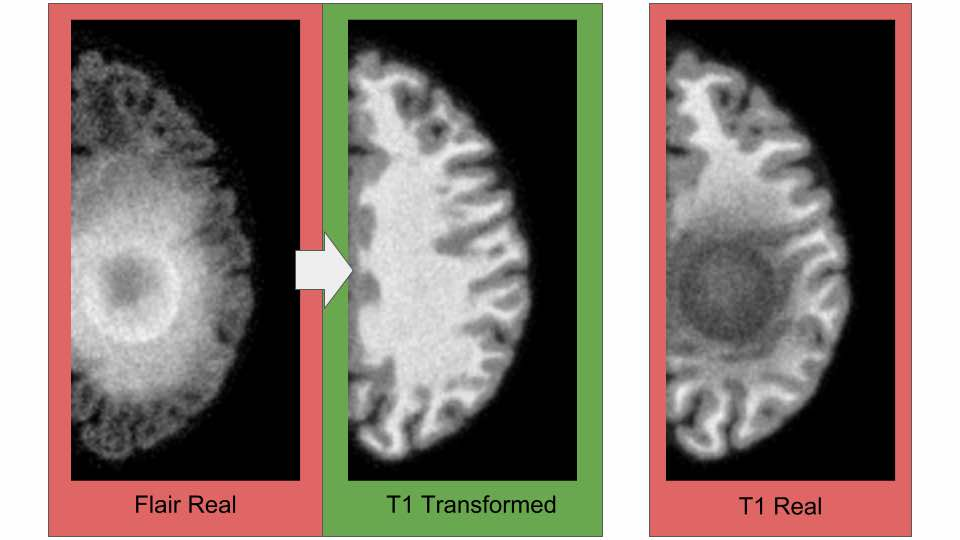
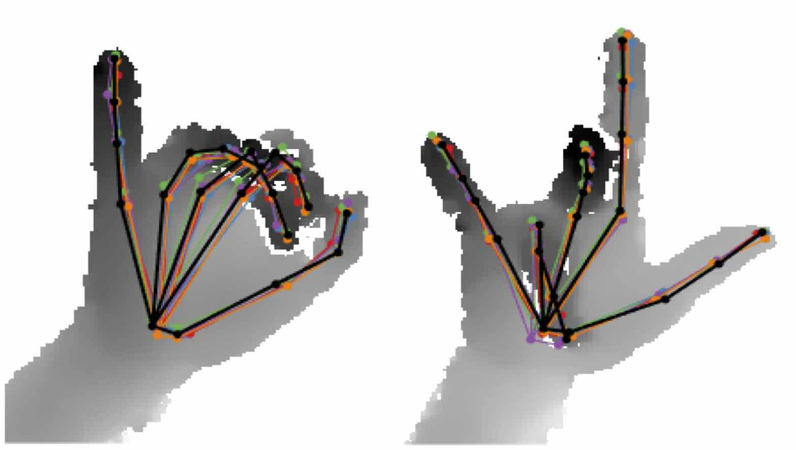
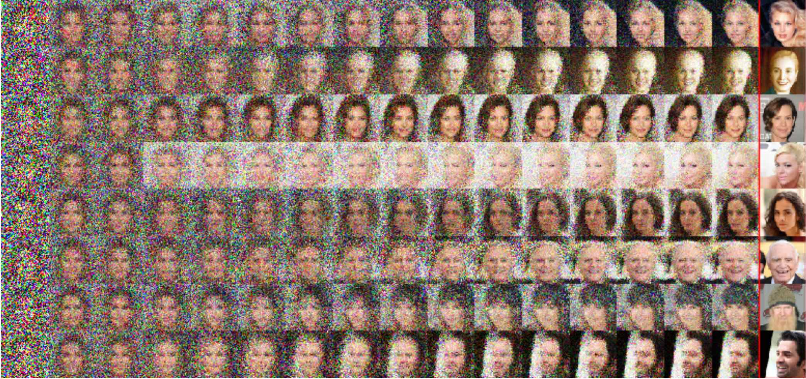
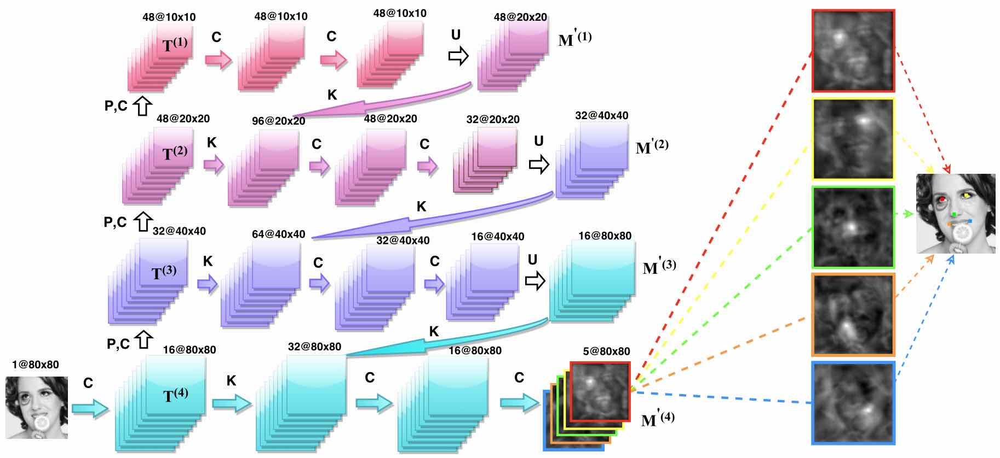
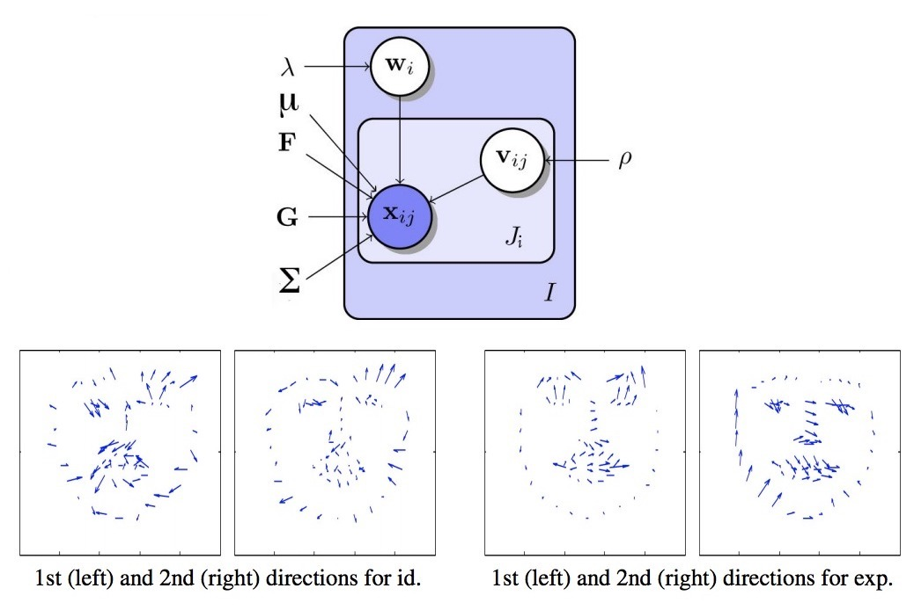
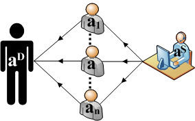

  

#### [Home](index.md) | [Research](research.md) | [Awards](awards.md) | [Hobbies](hobbies.md)

-----------------------------

[Google Scholar](https://scholar.google.com/citations?user=8uou2n4AAAAJ&hl=en)
 
 

## Machine Learning and Deep Learning
 

**[distribution matching losses can halucinate features in medical image translation](https://arxiv.org/abs/1805.08841)**  
Joseph Paul Cohen, Margaux Luck, **Sina Honari**
*Computer Vision and Pattern Recognition (CVPR)*, 2018 [[paper](https://arxiv.org/abs/1805.08841)][[poster](paper_info/2018_MICCAI_distribution_matching.md)].

 
 
 
 
 

**[How to Cure Cancer (in images) with Unpaired Image Translation](https://openreview.net/forum?id=SJIA3pijM)**  
Joseph Paul Cohen, Margaux Luck, **Sina Honari**
*Computer Vision and Pattern Recognition (CVPR)*, 2018 [[paper](https://openreview.net/forum?id=SJIA3pijM)].

 
 
 
 
 

**[Improving Landmark Localization with Semi-Supervised Learning](https://arxiv.org/abs/1709.01591)**  
**Sina Honari**, Pavlo Molchanov, Stephen Tyree, Pascal Vincent, Christopher Pal, Jan Kautz  
*Computer Vision and Pattern Recognition (CVPR)*, 2018 [[paper](https://arxiv.org/abs/1709.01591)][[poster](paper_info/2018_CVPR_semi_sup.md)].

 
 
 
 
 

**[Depth-Based 3D Hand Pose Estimation: From Current Achievements to Future Goals](https://arxiv.org/abs/1712.03917)**  
Shanxin Yuan, Guillermo Garcia-Hernando, Bjorn Stenger, Gyeongsik Moon, Ju Yong Chang, Kyoung Mu Lee, Pavlo Molchanov, Jan Kautz, **Sina Honari**, Liuhao Ge, Junsong Yuan, Xinghao Chen, Guijin Wang, Fan Yang, Kai Akiyama, Yang Wu, Qingfu Wan, Meysam Madadi, Sergio Escalera, Shile Li, Dongheui Lee, Iason Oikonomidis, Antonis Argyros, Tae-Kyun Kim  
*Computer Vision and Pattern Recognition (CVPR)*, 2018, spotlight presentation (**6.7%** of submissions) [[paper](https://arxiv.org/abs/1712.03917)].
 
 
 

**[Learning to generate samples from noise through infusion training](https://arxiv.org/abs/1703.06975)**  
Florian Bordes, **Sina Honari**, Pascal Vincent  
*International Conference on Learning Representations (ICLR)*, 2017 [[paper](https://arxiv.org/abs/1703.06975)][[poster](paper_info/2017_ICLR_infusion.md)].
 
 
 
 
 

**[Recombinator networks: Learning coarse-to-fine feature aggregation](https://arxiv.org/abs/1511.07356)**  
**Sina Honari**, Jason Yosinski, Pascal Vincent, Christopher Pal  
*Computer Vision and Pattern Recognition (CVPR)*, 2016, spotlight presentation (**9.7%** of submissions) [[paper](https://arxiv.org/abs/1511.07356)][[code](https://github.com/SinaHonari/RCN)][[poster](paper_info/2016_CVPR_RCN.md)].

 
 
 

  

**[Improving facial analysis and performance driven animation through disentangling identity and expression](https://arxiv.org/abs/1512.08212)**  
David Rim*, **Sina Honari***, Md Kamrul Hasan, Chris Pal  
*Image and Vision Computing Journal*, 2016 [[paper](https://arxiv.org/abs/1512.08212)].

 
 
 
 

-----------------------------

## Trust Estimation in Multi-Agent Systems
 

<h6>

My master’s research was on representing trust in multi-agent systems. A multi-agent system is composed of many interacting, rational and autonomous computer systems known as agents, each with their own objectives and knowledge of each other. In general agents may cooperate with each other or pursue their own objectives greedily. Trust is the expectation or the belief that a party will act benignly and cooperatively with the trusting party. In this research I proposed a trust representation of an agent based on possibility theory which allowed merging of information received from different agents considering the uncertainties in the acquired information. This allowed representing the trust of an agent through the information acquired from other agents.
</h6>

 
 

**Uncertainty-Based Trust Estimation in a Multi-Valued Trust Environment**  
Sina Honari, Brigitte Jaumard, Jamal Bentahar  
*International Journal on Artificial Intelligence Tools (IJAIT)*, 2013.

**An Approach on Merging Agents' Trust Distributions in a Possibilitic Domain**  
Sina Honari, Brigitte Jaumard, Jamal Bentahar  
*Communications in Computer and Information Science (CCIS)*, 2012.

**Merging Successive Possibility Distributions for Trust Estimation Under Uncertainty in Multi-Agent Systems**  
Sina Honari, Brigitte Jaumard, Jamal Bentahar  
*4th International Conference on Agents and Artificial Intelligence (ICAART)*, 2012.

**Under Uncertainty Trust Estimation through Unknown Agents, in a Multi-Valued Trust Environment**  
Sina Honari, Brigitte Jaumard, Jamal Bentahar  
*23rd International Conference on Tools with Artificial Intelligence (ICTAI)*, 2011.
 
 

-----------------------------

## Automated Market Mechanism
 

<h6> 

In the final years of my undergrad I worked on market mechanism design. As part of this research I participated in the international Trading Agent Competition - Market Design Scenation (TAC-CAT).
Market is a group of interacting entities through platforms like stock-exchanges, a decentralized system with interacting self-interested agents whose activities are buying and selling goods and services.
In this context, a mechanism is a combination of strategies available to participant agents in the system and the outcome rules, which provides solutions to resource allocation problems. The goal here was to design market makers.
The market makers can be thought of as the London Stock Exchange or NYSE which compete with each-other on the stock traders.
We designed a market maker by defining its policies such as which buy and sell demands (asks and bids) can be placed in the market and how to match them, setting the price of the transactions, and establishing the market clearing policy. The goal was to design the market policies in a way to attract potential buyers and sellers, maximize the percentage of matched asks and bids, and meanwhile maximize the profit of the market maker itself through the fees charged to the traders. The market policies were evaluated while several concurrent markets were in competition.
</h6>

 

**Price Estimation of PersianCAT Market Equilibrium**  
Sina Honari, Mojtaba Ebadi, Amin Fos-hati, Maziar Gomrokchi, Jamal Bentahar, Babak Khosravifar  
*International Joint Conference on Artificial Intelligence, Trading Agent Design and Analysis Workshop (IJCAI-TADA 09)*, 2009.

**Simulating New Markets by Introducing New Accepting Policies for the Conventional Continuous Double Auction**  
Sina Honari, Maziar gomrokchi, Mojtaba Ebadi, Amin Fos-hati, Jamal Bentahar  
*Agent-Directed Simulation Symposium (ADS'08)*, 2008.

**Evaluation of PersianCAT Agent's Accepting Policy in Continuous Double Auction, Participant in CAT 2007 Competition**  
Sina Honari, Amin Fos-hati, Mojtaba Ebadi, Maziar gomrokchi  
*International Computer Society of Iran Computer Conference (CSICC)*, 2008.
