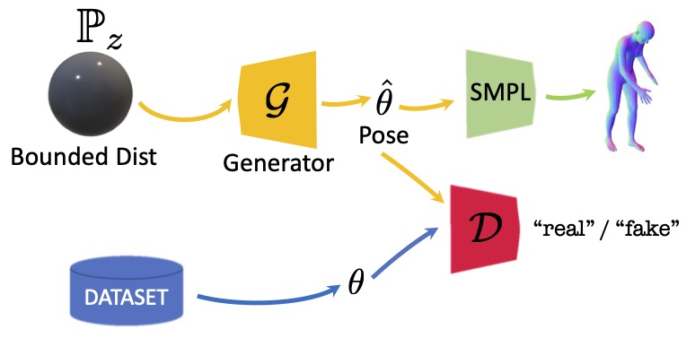
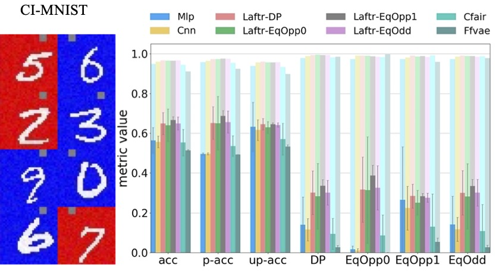
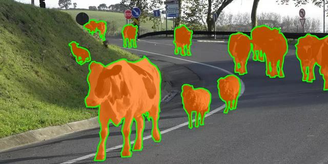

  

#### [Home](index.md) | [Research](research.md) | [Awards](awards.md) | [Hobbies](hobbies.md)

-----------------------------

[Google Scholar](https://scholar.google.com/citations?user=8uou2n4AAAAJ&hl=en)
 
 
 
 

**[Unsupervised 3D Keypoint Discovery with Multi-View Geometry](https://arxiv.org/abs/2211.12829)**   
**Sina Honari**, Chen Zhao, Mathieu Salzmann, and Pascal Fua.  
**International Conference on 3D Vision (3DV)**, 2024 [[poster](https://drive.google.com/file/d/1AuZE-_X6QaGWx5pA0UFKCcmeFou6SmP_/view?usp=sharing)][[paper](https://arxiv.org/abs/2211.12829)].

 
 
 
 
 
 
 

**[Occlusion Resilient 3D Human Pose Estimation](http://arxiv.org/abs/2402.11036)**   
Soumava Kumar Roy, Ilia Badanin, **Sina Honari**, and Pascal Fua.  
**International Conference on 3D Vision (3DV)**, 2024 [[poster](https://drive.google.com/file/d/1TYK-vmcEDZwaZEmu4gEKeX75AdnnFbYZ/view?usp=sharing)][[paper](http://arxiv.org/abs/2402.11036)].

 
 
 
 
 
 
 

**[Perspective Aware Road Obstacle Detection](https://ieeexplore.ieee.org/document/10044958)**   
Krzysztof Lis, **Sina Honari**, Pascal Fua, and Mathieu Salzmann.  
**IEEE Robotics and Automation Letters (RA-L)**, also presented at **IEEE/RSJ International Conference on Intelligent Robots and Systems (IROS)**, 2023 [[paper](https://arxiv.org/pdf/2210.01779.pdf)].

 
 
 
 

**[Overcoming the Domain Gap in Neural Action Representations](https://link.springer.com/article/10.1007/s11263-022-01713-6)**   
Semih Günel, Florian Aymanns, **Sina Honari**, Pavan Ramdya, and Pascal Fua.  
**International Journal of Computer Vision (IJCV)**, 2023 [[paper](https://link.springer.com/content/pdf/10.1007/s11263-022-01713-6.pdf?pdf=button)][[dataset](https://github.com/semihgunel/MC2P)].

 

**[Visual Question Answering From Another Perspective: CLEVR Mental Rotation Tests](https://openreview.net/pdf?id=aYbCpFNnHdh)**   
Christopher Beckham, Martin Weiss, Florian Golemo, **Sina Honari**, Derek Nowrouzezahrai, and Christopher Pal.  
**Pattern Recongnition**, 2023 [[paper](https://www.sciencedirect.com/science/article/pii/S0031320322006884?via%3Dihub)][[dataset](https://github.com/christopher-beckham/clevr-mrt)].

 
 
 

**[Temporal Representation Learning on Monocular Videos for 3D Human Pose Estimation](https://arxiv.org/pdf/2012.01511.pdf)**
**Sina Honari**, Victor Constantin, Helge Rhodin, Mathieu Salzmann, and Pascal Fua.  
**Transactions on Pattern Analysis and Machine Intelligence (TPAMI)**, 2022 [[paper](https://ieeexplore.ieee.org/abstract/document/9921314/)][[sldies](https://docs.google.com/presentation/d/1WtXwZpXFjclQ8AkJ2ef7ITp1xAtLD2Dg/edit?usp=sharing&ouid=104847692706554849617&rtpof=true&sd=true)].  
Best to download slides to see the videos.

 
 
 

**[On Triangulation as a Form of Self-Supervision for 3D Human Pose Estimation](https://arxiv.org/abs/2203.15865)**   
Soumava Kumar Roy\*, Leonardo Citraro\*, **Sina Honari**, and Pascal Fua.  
**International Conference on 3D Vision (3DV)**, 2022 [[paper](https://arxiv.org/abs/2203.15865)][[poster](https://drive.google.com/file/d/1teGqvkU8tS4VLn02R0jq0Lsaoxc92HHZ/view?usp=sharing)][[slides](https://docs.google.com/presentation/d/1HDWWSnswQHZt_obWt9l1aVRLF6SMFyDp/edit?usp=sharing&ouid=104847692706554849617&rtpof=true&sd=true)][[video](https://www.youtube.com/watch?v=DpA4OrR18d4&list=PLDqmL95Gm8yLluJMGuplQdre9QwnobvCt&index=5)][[dataset](https://www.epfl.ch/labs/cvlab/data/sportcenter-dataset/)].

 

**[Adversarial Parametric Pose Prior](https://arxiv.org/pdf/2112.04203.pdf)**   
Andrey Davydov, Anastasia Remizova, Victor Constantin, **Sina Honari**, Mathieu Salzmann, and Pascal Fua.  
**Computer Vision and Pattern Recognition (CVPR)**, 2022, Oral (**4%** of submissions) [[paper](https://arxiv.org/pdf/2112.04203.pdf)][[slides](https://docs.google.com/presentation/d/1mYsvY5Zjs0G6yqZWGX_Y5BlV7oXuzRbW/edit?usp=sharing&ouid=104847692706554849617&rtpof=true&sd=true)][[poster](https://drive.google.com/file/d/1s9yNZ2etxctZUSc7mKJgu8ihtAXTeL0i/view?usp=sharing)][[code](https://github.com/cvlab-epfl/adv_param_pose_prior)].

 
 

<!---

**[Detecting Road Obstacles by Erasing Them](https://arxiv.org/pdf/2012.13633.pdf)**   
Krzysztof Lis, **Sina Honari**, Pascal Fua, and Mathieu Salzmann.  
ArXiv pre-print, 2021 [[paper](https://arxiv.org/pdf/2012.13633.pdf)]].

 
 
 
 
 
 
 
--->

**[Benchmarking Bias Mitigation Algorithms in Representation Learning through Fairness Metrics](https://openreview.net/pdf?id=OTnqQUEwPKu)**   
Charan Reddy, Deepak Sharma, Soroush Mehri, Adriana Romero-Soriano, Samira Shabanian\*, and **Sina Honari\***,  
**Neural Information Processing Systems (NeurIPS)**, 2021 [[paper](https://openreview.net/forum?id=OTnqQUEwPKu)][[slides](https://drive.google.com/file/d/1-0JdsU9cDSRtUX1BOLH4H2T-UZ9bSAid/view?usp=sharing)][[video](https://recorder-v3.slideslive.com/#/share?share=54040&s=377dffa4-465c-4544-a4b5-679257b46c27)][[code](https://github.com/charan223/FairDeepLearning)].

 
 
 

**[SegmentMeIfYouCan: A Benchmark for Anomaly Segmentation](https://arxiv.org/pdf/2104.14812.pdf)**   
Robin Chan\*, Krzysztof Lis\*, Svenja Uhlemeyer\*, Hermann Blum*, **Sina Honari**, Roland Siegwart, Mathieu Salzmann, Pascal Fua, and Matthias Rottmann.  
**Neural Information Processing Systems (NeurIPS)**, 2021 [[paper](https://arxiv.org/pdf/2104.14812.pdf)][[slides](https://segmentmeifyoucan.github.io/segment-me-presentation/)][[website](https://segmentmeifyoucan.com/)][[code](https://github.com/SegmentMeIfYouCan/road-anomaly-benchmark)].

 
 
 

**[Lightweight Multi-View 3D Pose Estimation through Camera-Disentangled Representation](https://arxiv.org/pdf/2004.02186.pdf)**   
Edoardo Remelli, Shangchen Han, **Sina Honari**, Pascal Fua, and Robert Wang.  
**Computer Vision and Pattern Recognition (CVPR)**, 2020 [[paper](https://arxiv.org/pdf/2004.02186.pdf)][[slides](Images/research/slides/2020_CVPR_slides.pdf)][[video](https://drive.google.com/file/d/1lO9LNH5rL1eZ4vHuitLzLHhHXsAQn0rM/view?usp=sharing)][[code](https://github.com/edoRemelli/DiffDLT)].

 
 

**[On Adversarial Mixup Resynthesis](https://arxiv.org/abs/1903.02709)**  
Christopher Beckham, **Sina Honari**, Vikas Verma, Alex Lamb, Farnoosh Ghadiri, R Devon Hjelm, Yoshua Bengio, and Christopher Pal.  
**Neural Information Processing Systems (NeurIPS)**, 2019 [[paper](https://arxiv.org/abs/1903.02709)][[poster](https://drive.google.com/file/d/1w1X96Jv1rV5DVswnvS9AD3SBq1lvdOOF/view?usp=sharing)][[video](https://www.youtube.com/watch?v=ezbC3_VZeNY)][[code](https://github.com/christopher-beckham/amr)].

 
 
 

**[U-Net Fixed-Point Quantization for Medical Image Segmentation](https://arxiv.org/abs/1908.01073)**  
MohammadHossein AskariHemmat, **Sina Honari**, Lucas Rouhier, Christian S. Perone, Julien Cohen-Adad, Yvon Savaria, and Jean-Pierre David.  
**Medical Image Computing and Computer Assisted Intervention (MICCAI)**-Hardware Aware Learning for Medical Imaging and Computer Assisted Intervention workshop, 2019 [[paper](https://arxiv.org/abs/1908.01073)][[slides](https://drive.google.com/file/d/1avWVy_PAPq8CT745VywdwPHjS_YG9-Xp/view?usp=sharing)][[code](https://github.com/hossein1387/U-Net-Fixed-Point-Quantization-for-Medical-Image-Segmentation)].

 
 

**[Unsupervised Depth Estimation, 3D Face Rotation and Replacement](https://arxiv.org/abs/1803.09202)**  
Joel Ruben Antony Moniz, Christopher Beckham, Simon Rajotte,   **Sina Honari**, and Christopher Pal.  
**Neural Information Processing Systems (NeurIPS)**, 2018 [[paper](https://arxiv.org/abs/1803.09202)][[slides](https://drive.google.com/open?id=1TpDQ1124Pqh5AyQMqR-IXPG2mnvGtCrDyKPBILf_7ys)][[poster](https://drive.google.com/open?id=19ymxpQZhE9soainqVQe_xugawYIz8eq8)][[video](https://www.youtube.com/watch?v=h_brJWd7nNg&feature=youtu.be)][[code](https://github.com/joelmoniz/DepthNets/tree/master)].

 

**[Distribution Matching Losses Can Hallucinate Features in Medical Image Translation](https://arxiv.org/abs/1805.08841)**  
Joseph Paul Cohen, Margaux Luck, and **Sina Honari**.  
**Medical Image Computing and Computer Assisted Intervention (MICCAI)**, 2018, Oral (**4%** of submissions) [[paper](https://arxiv.org/abs/1805.08841)][[poster](https://drive.google.com/file/d/1XQs4B2Hxl4lZrMu8f5rQmwLJXcal1wnx/view?usp=sharing)][[slides](https://docs.google.com/presentation/d/1Vwj2Xt5oz4W3kMDbcSjnWrL6bcvaVK-KsHvXrds55rY/edit?usp=sharing)].

 
 
 
 

**[How to Cure Cancer (in images) with Unpaired Image Translation](https://openreview.net/forum?id=SJIA3pijM)**  
Joseph Paul Cohen, Margaux Luck, and **Sina Honari**.  
**Medical Imaging with Deep Learning (MIDL)**, 2018 [[paper](https://openreview.net/forum?id=SJIA3pijM)].

 
 
 
 
 

**[Improving Landmark Localization with Semi-Supervised Learning](https://arxiv.org/abs/1709.01591)**  
**Sina Honari**, Pavlo Molchanov, Stephen Tyree, Pascal Vincent, Christopher Pal, and Jan Kautz.  
**Computer Vision and Pattern Recognition (CVPR)**, 2018 [[paper](https://arxiv.org/abs/1709.01591)][[poster](https://drive.google.com/file/d/1_S7h-ZRViwcxblcLOK-sEqHbtYdNwczB/view?usp=sharing)][[slides](https://docs.google.com/presentation/d/1_8IWNenZnzEHsXZZXOQ7sh8M6Ylx_aYldymuRXIc0SA/edit?usp=sharing)][[video](https://www.youtube.com/watch?v=ZYx3jek0KCs)].

 
 
 
 

**[Depth-Based 3D Hand Pose Estimation: From Current Achievements to Future Goals](https://arxiv.org/abs/1712.03917)**  
Shanxin Yuan, Guillermo Garcia-Hernando, Bjorn Stenger, Gyeongsik Moon, Ju Yong Chang, Kyoung Mu Lee, Pavlo Molchanov, Jan Kautz, **Sina Honari**, Liuhao Ge, Junsong Yuan, Xinghao Chen, Guijin Wang, Fan Yang, Kai Akiyama, Yang Wu, Qingfu Wan, Meysam Madadi, Sergio Escalera, Shile Li, Dongheui Lee, Iason Oikonomidis, Antonis Argyros, and Tae-Kyun Kim.  
**Computer Vision and Pattern Recognition (CVPR)**, 2018, spotlight presentation (**6.7%** of submissions) [[paper](https://arxiv.org/abs/1712.03917)][[poster](https://drive.google.com/file/d/0B-tmaef4w8hxWUtSX0xkaHU2ajF0amxXVHducU81OS1mTXc4/view?usp=sharing)][[slides](https://docs.google.com/presentation/d/1ARs29WZsxRdkPNHH7Pv3y3q3agH9ZqPqDtflFNXaLE4/edit?usp=sharing)].
 
 
 

**[Learning to generate samples from noise through infusion training](https://arxiv.org/abs/1703.06975)**  
Florian Bordes, **Sina Honari**, and Pascal Vincent.  
**International Conference on Learning Representations (ICLR)**, 2017 [[paper](https://arxiv.org/abs/1703.06975)][[code](https://github.com/bordesf/Infusion)][[poster](https://drive.google.com/file/d/1L4Dy6o8QR2N65oWeUoNiJ0LQkzW2xRJc/view?usp=sharing)].
 
 
 
 
 

**[Recombinator networks: Learning coarse-to-fine feature aggregation](https://arxiv.org/abs/1511.07356)**  
**Sina Honari**, Jason Yosinski, Pascal Vincent, and Christopher Pal.    
**Computer Vision and Pattern Recognition (CVPR)**, 2016, spotlight presentation (**9.7%** of submissions) [[paper](https://arxiv.org/abs/1511.07356)][[code](https://github.com/SinaHonari/RCN)][[poster](https://drive.google.com/file/d/18-5tCLA6IglvkiApG4euePUIWYoh3zXG/view?usp=sharing)][[slides](https://docs.google.com/presentation/d/1gdxPKp731UrUwxqsUBoaFK-8S_2N6LsrJlTcswoIBFw/edit?usp=sharing)].

 
 

  

**[Improving facial analysis and performance driven animation through disentangling identity and expression](https://arxiv.org/abs/1512.08212)**  
David Rim\*, **Sina Honari\***, Md Kamrul Hasan, and Christopher Pal.  
**Image and Vision Computing Journal**, 2016 [[paper](https://arxiv.org/abs/1512.08212)].

 
 
 
 
